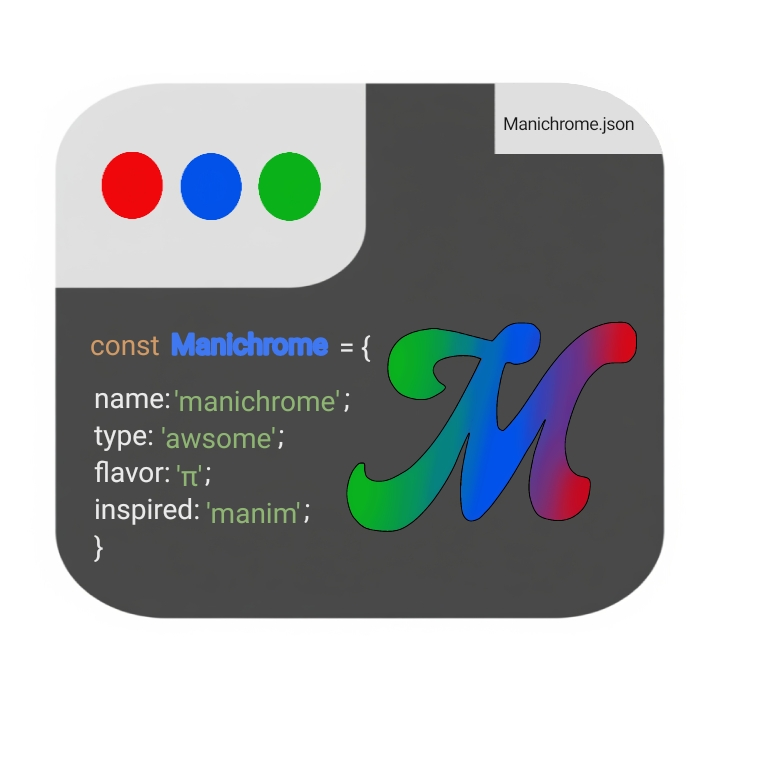

# Manichrome  



## 2.1.1
## New
## made fflate auto imported by importing manichrome;
## this library uses
### canvas 2d API
### fflate
###### all these examples is in the docs.html & scripts/docs.js
### Section 1 
in this section we will make a static rendering for a line  
first we will make the html file which we will use in all of the next scripts
```html
<!DOCTYPE html>

<html>
<head>
  <meta http-equiv="CONTENT-TYPE" content="text/html; charset=UTF-8">
  <title>Hello, World!</title>
</head>
<body>
 <script type="module" src="scripts/Manichrome.js"></script>
  <script type="module" src="scripts/docs.js"></script>
</body>
</html>

``` 
seconde we will make the js part  
```js
import * as Man from './manichrome.js';
// Section 1: Static Rendering
// This example shows how to render a simple static image using Manichrome.

// Step 1: Create the renderer (Main handles the canvas)
// Ensure your HTML body is empty when using Main
const main = new Man.Main2d(); 

// Step 2: Create a line from (0, 0) to (100, 100)
const line1 = new Man.Line({main:main,point1:[0,0],point2:[100,100],thick:2,color:[255,0,0,1]});

// Step 3: Draw the line on the canvas
line1.draw(); 
``` 
you should see a thin line. 

### Section 2 animating 

where gonna learn how to make basic animations using process like functions 
```js
//Section 2
import * as Man from './manichrome.js';
// This example shows how to animate a line using Manichrome

const main = new Man.Main2d();

// Create a line from (0, 0) to (100, 100)
const line1 = new Man.Line({main:main, point1:[0, 0],point2:[100,100]});

// Define the animation function (called every frame)
function anim(delta) {//delta is time of the frame 
    line1.draw();
    
    line1.point2[1] -= 100*delta/(10000/3);
}
3.3
// Add the animation to the process list
// Format: [function, startTime(ms), endTime(ms)]
// Note: animation functions should take no parameters
main.addProcess([anim, 0, 10000/3]);

// Start the animation loop
// Note: `refresh()` clears the canvas every frame,
// so all draw calls must be inside process functions
main.refresh();
```  
### Section 3 Other Objects & More Complex Animations 
```js
import * as Man from './manichrome.js';
//Section 3
const main = new Man.Main2d();

// Create a line from (0, 0) to (60, 80)
const line1 = new Man.Line({main:main,point1:[0,0],point2:[60,80]});

// Create a circle centered at (0, 0) with radius 100 and full angle (2π)
const cir = new Man.Circle({main:main,center:[0,0],r:100});


let i = 0;

// Animate: Move the end point of the line along a circular path
// Using line1.update(radius, angle), which updates x2, y2
function anim(delta) {
    line1.update(100, i); // Move the line's end point around a circle
    line1.draw();
    cir.draw(); // Keep redrawing the static circle for reference

    i += Math.PI / 30; // Increment angle for smooth circular motion
    //you could increment using delta for more acuraccy
}

// Add the animation to run for 3 seconds (3000 ms)
main.addProcess([anim, 0, 3000]);

// Start the animation loop
main.refresh();
```

### Section 4 Rotation, Fading, and Multiple Objects  
```js
import * as Man from './manichrome.js';
//Section 4
const main = new Man.Main2d();

// Create basic objects
const line = new Man.Line({main:main,point1:[200,0],point2:[100,0]}); // A line from (200,0) to (100,0)
const cir = new Man.Circle({main:main,center:[0,0],r:100}); // circle({main,center,r,startAngle,endAngle,thick,lineColor,isLine,isClosed,isFilled,fillColor}))
const rect = new Man.Rect({main:main,width:160,height:120,center:[0,0],isFilled:true,fillColor:[0,0,0,0]}); // Rectangle centered at (0,0)
const dot = new Man.Dot({main:main,point:[100,0]}); // Dot starting at (100,0)

// Initial setup
let i = 0;     // Angle
let j = 0;     // Green channel for rect color
let dir = true; // Direction of green fade (true = increasing)

// Rectangle styling
// Line styling
line.color = [255, 0, 255, 1]; // Magenta

// Circle styling
cir.isFilled = true;
cir.fillColor = [255, 0, 0, 0.1]; // Red with low opacity
cir.lineColor = [0, 0, 255, 1];   // Blue outline

function anim(delta) {
    // Draw all shapes
    line.draw();
    rect.draw();
    cir.draw();
    dot.draw();

    // Update green color value between 0 and 255
    dir ? j++ : j--;
    if (j >= 255 || j <= 0) dir = !dir;

    // Animate angle
    i += Math.PI / 120;

    // Move line's end point in a circle
    line.point2[0] = Math.cos(i) * 100;
    line.point2[1] = Math.sin(i) * 100;

    // Rotate the rectangle
    rect.theta = i;

    // Move the dot in a circle
    dot.point = [Math.cos(i) * 100, Math.sin(i) * 100];

    // Fade in/out green-filled rectangle
    rect.fillColor = [0, j, 0, j / 255];
}

main.addProcess([anim, 0, 10000]);
main.refresh();
// note in the [func ,start, finish,obj] such obj={con:condition}(if obj.con=true it terminates its process)
// you can make finish = undifined for infinit loop 

```
### Section 5 PixelModefyers
```js
import * as Man from './manichrome.js';
//Section 5
var i = 0;
const main = new Man.Main2d();
const Pi = new Man.PixelMod({main:main,width:150,height:255,center:[0,0]}); // width=150, height=255, origin

// Set pixel color based on position and animation frame
function P(x, y) {
    Pi.currentPixelColor = [
        Math.abs(Math.cos(i) * (255 - y)), // Red fades with y
        0,
        Math.abs(Math.sin(i) * y),         // Blue increases with y
        255                                // Fully opaque
    ];
}
Pi.loop = P;

// Animation function (called each frame)
function frames(delta) {
    Pi.draw();
    i += Math.PI / 60; // Advance angle
    console.log(delta); // Print frame time
}

main.addProcess([frames, 0, 10000]);
main.refresh();

```
### Section 6 using Sprites
```js
import * as Man from './manichrome.js';

//Section 6
const main = new Man.Main2d();

// Load a sprite image at position [0, 0]
const spr = new Man.Sprite({main:main,center:[0,0],dir:'./scripts/THK.jpeg'});

// Create a circle centered at [0, 0] with radius 100
const cir = new Man.Circle({main:main,center:[0,0],r:100});

// Note: circle is not filled by default
// cir.isFilled = true;

function anim(delta) {
    // Draw the sprite first (it will appear behind the circle if overlapped)
    spr.draw();

    // Draw the circle on top
    cir.draw();
}

// Add the draw function to the animation loop (start at 0ms, end after 10 seconds)
main.addProcess([anim, 0, 10000]);

// Start the render loop
main.refresh();

``` 
 Important: Sprites should not be used statically with other objects.
 Their draw order may get overridden unless part of an animation loop.
 

 ### section 7 Rotation and Vectors

 ```js
 //Section 7
const main = new Man.Main2d();

// Create a full circle centered at (0,0) with radius 100
const cir = new Man.Circle({main:main,center:[0,0],r:100});

// Create a horizontal line (X-axis)
const X = new Man.Line({main:main,point1:[-200,0],point2:[200,0]});

// Create a vertical line (Y-axis) starting and ending at offset from center
const Y = new Man.Line({main:main,point1:[100,200],point2:[100,-200]});

// Create a diagonal line starting from center
const lineA = new Man.Line({main,point1:[0,0],point2:[200,200]});

// Create a dot placed initially at (0, 100)
const dot = new Man.Dot({main:main,point:[0,100]});

// Create a rectangle with width=160, height=120, centered at (0,0)
const rect = new Man.Rect({main:main,width:160,height:120,center:[0,0]});

// Extra dot for future use (currently unused)
const RDot = new Man.Dot(main, [50, 0]);

// Create a triangle pointing upwards with its center roughly at origin
const tri = new Man.Triangle({main:main,point1:[-80,-60],point2:[80,-60],point3:[0,100]});

// Create a vector starting from center and pointing to the right
const vec = new Man.Vector({main:main,point1:[0,0],point2:[100,0],tipSize:5});

// Initialize the animation angle variable
let i = 0;
const step = Math.PI / 120; // Increment angle slowly for smooth motion

// First animation: runs for 2 seconds
function circle(delta) {
    // Draw all static objects
    cir.draw();
    X.draw();
    Y.draw();
    dot.draw();
    lineA.draw();

    // Increase angle slightly
    i += step;

    // Animate vertical movement of X line's ends
    X.point1[1] = X.point2[1] = Math.sin(i) * 100;

    // Animate horizontal movement of Y line's ends
    Y.point1[0] = Y.point2[0] = Math.cos(i) * 100;

    // Rotate the diagonal line endpoint in a circle
    lineA.update(100, i);

    // Rotate the rectangle around its center
    rect.scale = [1, 1]; // Keep size the same
    rect.theta = i;      // Rotate by angle i
    rect.draw();

    // Move the dot in a circular path
    dot.point = [Math.cos(i) * 100, Math.sin(i) * 100];

    // Rotate the triangle around origin
    tri.theta = i;
    tri.draw([0,0]);
}

// Second animation: shows after the first 2 seconds (until 10s)
function Vect(delta) {
    // Update the vector to point in a rotating direction
    vec.update(100, i);
    vec.draw();

    // Optionally, draw the circle as background reference
    cir.draw();

    // Continue updating angle
    i += step;
}

// Run the circle animation from 0 to 2 seconds
main.addProcess([circle, 0, 2000]);

// Then run the vector animation from 2 seconds to 10 seconds
main.addProcess([Vect, 2000, 10000]);

// Start the animation loop and rendering
main.refresh();
 
 ```
 ### Section 8 paths
 ```js
 import * as Man from './manichrome.js';
 //Section 8
// Create the main canvas
const main = new Man.Main2d();

// Create an empty linear path (a series of connected line segments)
const path = new Man.LinearPath({main:main});

// Loop to generate 100 points forming the path
for (let i = 0; i <= 100; i++) {
    // Add a point (x, y) to the path
    // x = i, y = 2i => this forms a straight line with slope 2
    path.points.push([i,2*i]);     // x-coordinate
     // y-coordinate

    // Assign a color for each segment (makes it a gradient)
    // Red increases gradually from 0 to 255 as i increases
    path.color.push([i * 2.55, 0, 0, 1]); // RGBA (red gradient, fully opaque)
}
//the number of colors in the array should equal to the number of x or y points in path.point
// Create a vector (arrow) starting from (0,0) to (100,100)
const vec = new Man.Vector({main:main,point1:[0,0],point2:[100,100],color:[255, 0, 0, 1]}); // Red color, fully opaque

// Draw the path (a red gradient line following y = 2x)
path.draw();

// Draw the vector (a red arrow)
vec.draw();


 ```
 ### Section 9 Vector rotation Path tracing (4 vectors)
 ```js
 import * as Man from './manichrome.js';
//Section 9
// Create the canvas context

const main = new Man.Main2d();

// Create four vectors that will be chained end-to-start
const vec = new Man.Vector({main:main, point1:[0, 0],point2: [0, 0]});
const vec2 = new Man.Vector({main:main, point1:[0, 0],point2: [0, 0]});
const vec3 = new Man.Vector({main:main, point1:[0, 0],point2: [0, 0]});
const vec4 = new Man.Vector({main:main, point1:[0, 0],point2: [0, 0]});

// Create a path to trace the tip of the last vector (vec4)
const path = new Man.LinearPath({main:main});

let i = 0;   // angle/time controller
let j = -1;  // decay index

function anim(delta) {
    // === Update the vector chain ===

    // Update vec to rotate with angle i and length 50
    vec.update(50, i);

    // vec2 starts where vec ends
    vec2.point1[0] = vec.point2[0];
    vec2.point1[1] = vec.point2[1];
    vec2.update(40, i * 2);

    // vec3 starts where vec2 ends
    vec3.point1[0] = vec2.point2[0];
    vec3.point1[1] = vec2.point2[1];
    vec3.update(25, -i); // opposite direction

    // vec4 starts where vec3 ends
    vec4.point1[0] = vec3.point2[0];
    vec4.point1[1] = vec3.point2[1];
    vec4.update(40, -2 * i); // even faster opposite

    // === Trace the motion ===

    // Add the end point of vec4 to the path
    path.points.push([vec4.point2[0],vec4.point2[1]]);// x
    //y

    // Assign color based on i (animated hue)
    // NOTE: hsla's S (saturation) parameter is **broken** in Man engine so keep it 1 
    path.color.push(main.hsla(i * 20, 1, 0.5, 1));

    // === Decay Effect ===

    // Gradually reduce alpha of earlier path points to create a fading trail
    for (let k = 0; k < j; k++) {//each frame the number j increases so the number of pixels decaying increases
        path.color[k][3] -= 1 / 255; // reduce alpha
    }

    // === Draw Everything ===

    vec.draw();
    vec2.draw();
    vec3.draw();
    vec4.draw();
    path.draw();

    // === Update time and decay index ===
    i += delta * Math.PI / 3000;
    j++;

    // === Clear faded points ===

    // If the first point in the trail is fully transparent, remove it
    if (path.color[0][3] <= 0) {
        path.color.shift();     // remove first color
        path.points.shift();    // remove x  y
        j--;                    // decay index should follow
    }
    //console.log(delta)
}
main.addProcess([anim,1000,undefined]);
main.refresh();
 ```
 ### Section 10 animting on pixelMods
 ```js
 import * as Man from './manichrome.js';
//Section 10
const main = new Man.Main2d(); // Initialize the drawing engine

// Create a pixel canvas (200×260 pixels), centered at [0,0]
const vis = new Man.PixelMod({main:main,width:200,height:260,center:[0,0]});

let i = 0; // A time variable to animate colors

// === Pixel Coloring Function ===
// This will be called automatically for each pixel (x, y)
function loop(x, y) {
    // x ranges from 0 to 199, y from 0 to 259

    // Use a formula to generate a changing color based on pixel position and time
    // main.hsla(hue, saturation, lightness, alpha)
    // NOTE: saturation = 1 is always forced in this engine (others are almost no diffrence)
    vis.currentPixelColor = main.hsla((y + 2 * x) * 360 / 460 + i, 1, 1, 255);
    // Explanation:
    // (y + 2x): creates diagonal color gradient
    // *360/460: maps values into a hue range
    // +i: animates the hue over time
}
vis.loop = loop; // Assign the loop function to the pixel module

// === Animation Loop ===
function anim(delta) {
    i += 60 * delta / 1000; // Increase hue offset over time (delta is in ms)
    vis.draw();             // Redraw the pixel canvas with updated hue
    console.log(delta);     // Print time difference between frames (optional)
}

// Add the animation process to run continuously
main.addProcess([anim, 0, 10000]);
main.refresh(); // Start the rendering loop
```
### Section 11 using pixel mods to visualize density
D(x,y)=yCos(xy°);

```js
import * as Man from './manichrome.js';
//Section 11
const main = new Man.Main2d();
const vis = new Man.PixelMod({main:main,width:200,height:260,center:[0,0]});

function loop(x, y) {
    // Calculate the density value at pixel (x,y) using y * cos(x*y)
    // This gives a varying pattern depending on x and y

    // Normalize density to a hue angle (0 to 360 degrees):
    // We multiply by 360/200 to scale y values to fit into hue range
    // We subtract from 360 to reverse the colors so high density values get red,
    // and low values get blue/green. This inversion is for better visual contrast.
    let density = y * Math.cos(x * y*Math.PI/180);
    let hue = 360 - density * 360 / 200;

    // Set pixel color using HSLA:
    // hue = calculated from density,
    // saturation = 1 (full color),
    // lightness = 1 (bright),
    // alpha = 255 (fully opaque)
    vis.currentPixelColor = main.hsla(hue, 1, 1, 255);
}

vis.loop = loop;
vis.draw();
```
### Section 12 grid and graphs 
```js
import * as Man from './Manichrome.js';
//Section 12
function f(x){//this will be the graph function
   return x**2;
}
const main=new Man.Main2d();//make canvas
const grid=new Man.Grid({main:main,px:50,py:50,d:1})//we create a grid with 50px 50 px margins and divisions of 1
const graph=new Man.LinearGraph({main:main,func:f,dom:[-5,5],px:50,py:50})//we make a graph we paa main ,f(x),[startX,endX],xMargin,yMargin
//change increment for smoother approximation {inc:number}
grid.draw();
graph.draw()
```
### Section 13 TouchEventListener 
```js
import * as Man from './Manichrome.js';
//Section 13
const main =new Man.Main2d();
const dot =new Man.Dot({main:main,point:[-50,0]});//we create two dots 
const dot2 =new Man.Dot({main:main,point:[50,0]});
const event =new Man.TouchEventListener({main:main});//we create an event listener 
event.dots.push(dot);
event.dots.push(dot2);//we push the two dot to be draggable
dot.size=10;
dot2.size=10;
event.call();//we call to start
//the toch will snap to the nearest dot 
//event listners only works with dots
function anim(delta){
    dot.draw();
    dot2.draw();//here we show then
}
main.addProcess([anim,0,undefined]);
main.refresh();
```
### Section 14 moving a line
```js
import * as Man from './Manichrome.js';
//Section 14
const main =new Man.Main2d();
const dot =new Man.Dot({main:main,point:[100,100]});//we create a dot
const line =new Man.Line({main:main,point1:[0,0],point2:[100,100],thick:2})
const event =new Man.TouchEventListener({main:main});
event.dots.push(dot);
event.fun=(e)=>{//this function apply when the touch is moving (one finger only like when the dot moves)
    line.point2[0]=dot.point[0];//we can update line in anim but this is better for no delays
    line.point2[1]=dot.point[1];
};
event.call();
function anim(delta){
    dot.draw();
    line.draw();
}
main.addProcess([anim,0,undefined]);
main.refresh();
```
you could also not draw the dot so it doesnt show ;
### Section 15 

```js
import * as Man from './Manichrome.js';
//Section 15
const main =new Man.Main2d();
const dot =new Man.Dot({main:main,point:[100,0],size:4});
const vec =new Man.Vector({main:main,point1:[0,0],point2:[0,0],tipSize:3});
//vec.tipSize=3;
var V=0;//velocity
var F=0;//force
function anim(delta){
    F=-dot.point[0]/300;
    V+=F;
    dot.point[0]+=V;
    dot.draw();
    vec.point2[0]=dot.point[0];
    vec.draw();//bsiclly we say that F=-alpha *X and update with out solving
    //you can slove it and use trigeometry cos or sin 
}
main.addProcess([anim,0,undefined]);
main.refresh();
}
main.addProcess([anim,0,undefined]);
main.refresh();
 ```
 ### Section 16 built in animation 
 ```js
 const main=new Man.Main();
//Section 16 
const main =new Man.Main2d();
const line=new Man.Line({main:main,point1:[-100,-100],point2:[-100,-100]});
line.makeAnimation({color:[255,0,0,1],thick:5,startTime:1000,endTime:3000,type:"linear"});
line.makeAnimation({point1:[-100,-100],point2:[100,100],startTime:1000,endTime:3000,type:"easeInOutSin"});

const vec =new Man.Vector({main:main,point1:[100,100],point2:[100,100],tipSize:0});
//vec.thick=0;
//vec.color[3]=0;
//vec.tipSize=0;
vec.makeAnimation({point2:[-100,-100],color:[0,0,255,1],thick:3,tipSize:3,startTime:1000,endTime:3000});
function anim(delta){
   line.draw();
    vec.draw();
    //console.log(vec.point[2]);
}
main.addProcess([anim,1000,10000]);
main.refresh(); 


```
 these animations apply to most object and can be stacked like animate point1 linear but point 2 easeIn
type can be [linear,easeIn,easeOut,easeInOut,easeInSin,easeInOutSin,easeOutSin] 

## Section 17 download
you do not need to import the fflate module;

```js
import * as Man from './Manichrome.js';
const main =new Man.Main2d();
const bg=new Man.Rect({main:main,width:window.innerWidth,height:window.innerHeight,isLine:false,isFilled:true,fillColor:[0,230,230,1],center:[0,0]})
const l=new Man.Line({main:main,point1:[0,0],point2:[200,200],thick:5})
function anim(delta){
    bg.draw();
    l.point2[1]-=delta/10;
    l.draw();
}
main.addProcess([anim,0,2000]);
//main.refresh();
main.compile(2000,20,"framy.zip");//insead of calling refresh you call compile
```
it will soon be bundled to the lib ___fflate___ but for now you have to add it by CDN 


